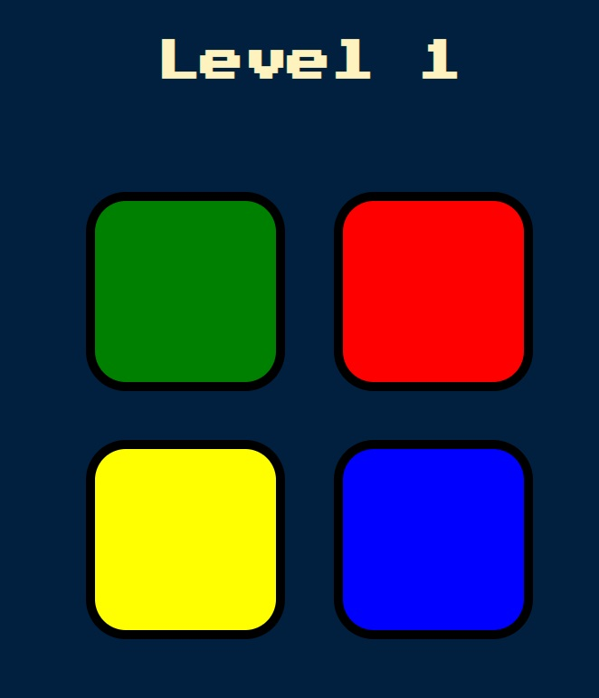

# Simon Game

This was a challenge to create a Simon-like memory game using jQuery.

## Table of Contents

  - [Table of Contents](#table-of-contents)
  - [Technologies Used](#technologies-used)
  - [Screenshots](#screenshots)
  - [Usage](#installation)
  - [Questions?](#questions)

## Technologies Used

- HTML
- CSS
- JavaScript
- jQuery

## Screenshots

## Usage

You can use it by going to the [deployed site](https://clos86.github.io/Simon-Game/). 

## Questions?

If you have any questions about this projects, please contact me directly at [c.vazquez1986@gmail.com](mailto:c.vazquez1986@gmail.com).  
You can view more of my projects at [Clos86](https://github.com/Clos86).
